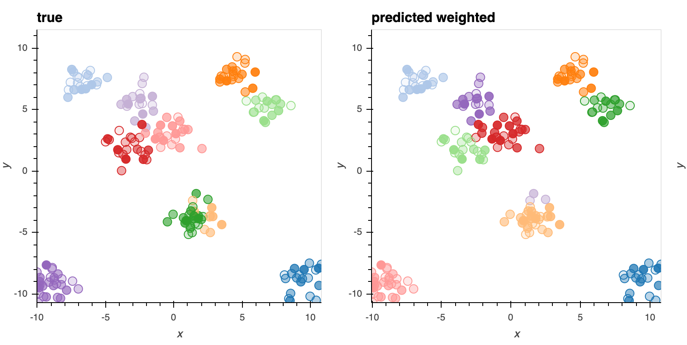

# Weighted Dirichlet Process Gaussian Mixture Model 
This repo extends [sklearn.mixture.BayesianGaussianMixture](https://scikit-learn.org/stable/modules/generated/sklearn.mixture.BayesianGaussianMixture.html) to support weighted training examples.

Complies with `sklearn.fit` API
-  `sample_weight` is a vector, same length as `X`. It must be `>=1` corresponding to duplicates or counts of observations otherwise the GMM model does not make sense.


```python
import numpy as np
from dpm.dpgmm import WeightedDPGMM

# make some data

num_clusters = 10
N = 200

x_means = 20 * np.random.rand(1, num_clusters, 2) - 10
y = np.random.randint(num_clusters, size=N)
x = .08 * np.random.randn(N, 1, 2)

temp = np.zeros((N, num_clusters, 1))
temp[np.arange(N), y, :] = 1

x = (x + x_means * temp).sum(1)
sample_weight = np.random.randint(1, 50, size=len(x))

# train the model

model = WeightedDPGMM(n_components=20, max_iter=1000, verbose=1)
yhat = model.fit_predict(x, sample_weight=sample_weight)

```
### True vs Inferred Clusters



