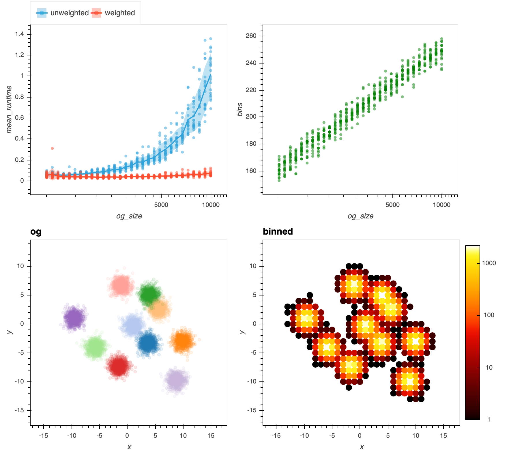

# Weighted Dirichlet Process Gaussian Mixture Model 
This repo extends [sklearn.mixture.BayesianGaussianMixture](https://scikit-learn.org/stable/modules/generated/sklearn.mixture.BayesianGaussianMixture.html) to support weighted training examples.

Complies with `sklearn.fit` API
-  `sample_weight` is a vector, same length as `X`. It must be `>=1` corresponding to duplicates or counts of observations otherwise the GMM model does not make sense.

[example notebook](example.ipynb)

```python
import numpy as np
from dpm.dpgmm import WeightedDPGMM

# make some data

num_clusters = 10
N = 200

x_means = 20 * np.random.rand(1, num_clusters, 2) - 10
y = np.random.randint(num_clusters, size=N)
x = .08 * np.random.randn(N, 1, 2)

temp = np.zeros((N, num_clusters, 1))
temp[np.arange(N), y, :] = 1

x = (x + x_means * temp).sum(1)
sample_weight = np.random.randint(1, 50, size=len(x))

# train the model

model = WeightedDPGMM(n_components=20, max_iter=1000, verbose=1)
yhat = model.fit_predict(x, sample_weight=sample_weight)

```
### True vs Inferred Clusters


### Run Time Comparison to Regular Unweighted Implementation
Distribution over 20 trials. As we expect, each iteration is proportional to the number of samples. So if we bin the input then we get a speed up. More input points and larger bin sizes result in more gains (with loss of accuracy obvi). 

This is with the following model parameters: `max_iter=1000, tol=1e-6, covariance_type="diag"`

```python
from timeit import timeit

tol = 1e-6
num_iters = 1000
cov_type = "diag"

def run_model(x,w,seed):
    model = WeightedDPGMM(n_components=20, verbose=0, max_iter=num_iters, tol=tol, covariance_type=cov_type,random_state=seed)
    labels = model.fit_predict(x, sample_weight=w)
    
def run_model_unweighted(x,seed):
    model = BayesianGaussianMixture(n_components=20, verbose=0, max_iter=num_iters, tol=tol, covariance_type=cov_type,random_state=seed)
    labels = model.fit_predict(x)
    
def time_model(x,w=None,kind="weighted",number = 1, seed = None):
    
    if kind == "weighted":
        dt =  timeit(lambda: run_model(x,w,seed),number=number)
    else:
        dt =  timeit(lambda: run_model_unweighted(x,seed),number=number)
        
    return dict(dt = dt/number, kind=kind, size = len(x))

out = []
r = 0
seed=None
x_df = make_data()

for i in tqdm.trange(50):
    for num_points in tqdm.tqdm(np.logspace(3,4,30),leave=False):
        x_sample = x_df.sample(int(num_points))
        x = x_sample.loc[:,["x","y"]].values
        o = time_model(x,w=None,kind="unweighted",seed= seed)
        o["og_size"] = int(num_points)
        out.append(o)

        x_df_rounded = x_sample.round(r).groupby(["x","y"]).size().to_frame("weight").reset_index()
        x = x_df_rounded.loc[:,["x","y"]].values
        w = x_df_rounded.loc[:,"weight"].values
        o = time_model(x,w=w,kind="weighted",seed = seed)
        o["og_size"] = int(num_points)
        out.append(o)

```

[run time test notebook](runtime_test.ipynb)




